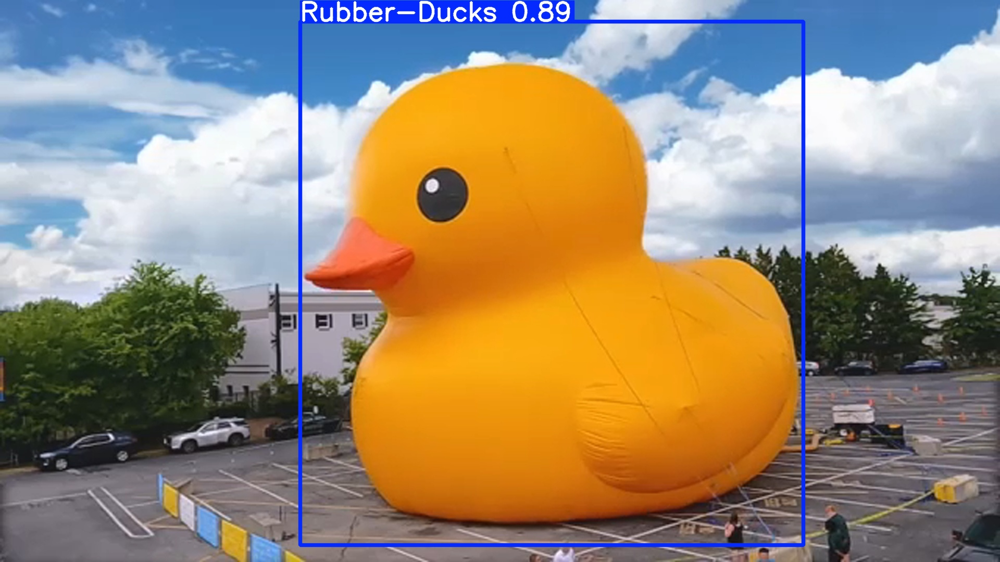

# 🦆 Rubber Duck Detection

[](https://python.org)
[](https://fastapi.tiangolo.com)
[](https://ultralytics.com)

An intelligent rubber duck detection system powered by YOLOv11, featuring a modern web interface and REST API for real-time predictions.

## ✨ Features

- 🎯 **High-accuracy detection** using YOLOv11 model
- 🚀 **FastAPI backend** with REST endpoints
- 🎨 **Beautiful web interface** with real-time predictions
- 📊 **Confidence scores** for probabilistic outputs
- 🖼️ **Visual results** with bounding boxes and labels
- 📥 **Download functionality** for processed images
- 🔄 **Auto-cleanup** of temporary files
- 📱 **Responsive design** for all devices

## 🛠️ Installation

### Prerequisites
- Python 3.8+
- pip

### Setup
```bash
# Clone the repository
git clone https://github.com/luiz826/rubber-duck.git
cd rubber-duck

# Install dependencies
pip install -r requirements.txt
```

## 🚀 Quick Start

### Running the Web Application
```bash
# Start the FastAPI server
uvicorn app.main:app --reload

# Open your browser and navigate to:
# http://127.0.0.1:8000/static/index.html
```

### Using the Command Line Interface
```bash
# Run inference on a single image
python src/infer.py path/to/your/image.jpg path/to/output.jpg
```

## 📋 API Endpoints

### `POST /predict`
Upload an image and get duck detection results
- **Input**: Image file (multipart/form-data)
- **Output**: JSON with detection status and confidence score

### `GET /result/{filename}`
Get the processed image with bounding boxes and labels
- **Input**: Filename from prediction response
- **Output**: Image file with visual annotations

### `DELETE /cleanup/{filename}`
Clean up temporary files
- **Input**: Filename to remove
- **Output**: Cleanup status

## 🏗️ Project Structure

```
rubber-duck/
├── app/                    # FastAPI web application
│   ├── main.py            # API server and endpoints
│   └── static/            # Frontend files
│       ├── index.html     # Web interface
│       └── style.css      # Styling
├── src/                   # Core detection code
│   ├── infer.py          # Inference engine
│   ├── train.py          # Training script
│   └── eval.py           # Evaluation utilities
├── models/               # Trained models
│   └── rubber-duck-model.pt
├── data/                # Training dataset
└── requirements.txt     # Dependencies
```

## 🎯 Training

The model was trained using YOLOv11 on a custom rubber duck dataset. The training process is documented in this [Google Colab notebook](https://colab.research.google.com/drive/1NbLwr5z3OTAIZo1zGFBp-leEsHZzqsgc?authuser=0#scrollTo=1qIKfrm6qtzn).

### Training Details
- **Model**: YOLOv11n (nano version)
- **Dataset**: Custom rubber duck images with annotations
- **Classes**: 1 class (Rubber-Ducks)
- **Image Size**: 640x640
- **Epochs**: 50

## 📊 Results

The model achieves excellent performance on rubber duck detection with high confidence scores and accurate bounding box predictions.



## 📄 License

This project is licensed under the MIT License - see the [LICENSE](LICENSE) file for details.

## 👨‍💻 Author

**Luiz Fernando Costa dos Santos**

